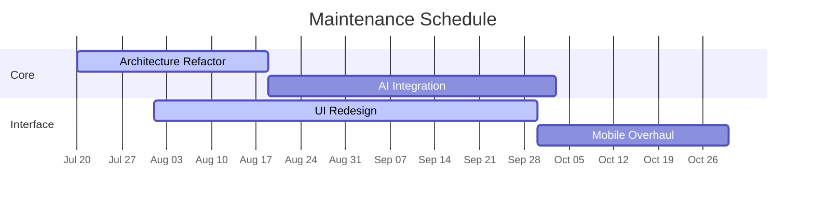

> general hosting by Njabulo Jb WhatsApp bot multi device ✓

  
**Status**: `Active Maintenance`  
**Estimated Completion**: 2025-11-20  
**Progress**: 
```diff
+ Completed [██████████░░░░░░░░░░░░] 40%
- Pending  [░░░░░░░░░░░░░░░░░░░░░░] 60%
```

##  Timeline



> *Tap here Start building bot*

[](https://hoo.be/njabulo.onlinebw)


##  **[Njabulo Jb star dev Features message via ad]**

<table>
<tr>
<td width="50%">

### 🤖 **AI-Powered**
- 🧠 **Multiple AI Providers** - OpenAI & Anthropic support
- 💬 **Context-Aware** - Remembers conversation history
- 🎯 **Smart Responses** - Natural, human-like interactions
- 🌍 **Multi-Language** - Responds in user's language

</td>
<td width="50%">


### **[WhatsApp Integration]**
- 🔐 **Dual Auth** - QR Code & Pairing Code support
- 🔄 **Auto-Reconnect** - Never miss a message
- 💾 **Session Persistence** - Maintains connection across restarts
- ⚡ **Real-time** - Instant message processing

</td>
</tr>
<tr>
<td width="50%">

### **[Developer Friendly]**
- 🚀 **One-Click Deploy** - Multiple platform support
- 📊 **Health Monitoring** - Built-in status endpoints
- 📝 **Comprehensive Logging** - Track all interactions
- 🐳 **Docker Ready** - Containerized deployment

</td>
<td width="50%">

### **[Rich Commands]**
- `/start` - Activate bot in chat
- `/stop` - Deactivate bot
- `/help` - Show all commands
- `/status` - Bot statistics
- `/clear` - Reset conversation

</td>
</tr>
</table>


---

##  **[WhatsApp Authentication]**

<div align="center">

### Choose Your Authentication Method

<table>
<tr>
<td width="50%" align="center">

#### 📱 **QR Code Method**
*Quick & Easy*

1. Set `USE_PAIRING_CODE=false`
2. Run the bot
3. Scan QR code with WhatsApp
4. ✅ Connected!

</td>
<td width="50%" align="center">

[_Pairing Code Method_]
*Recommended for Deployment*

1. Set `USE_PAIRING_CODE=true`
2. Add your `PHONE_NUMBER`
3. Get 8-digit code from logs
4. Enter in WhatsApp > Linked Devices
5. ✅ Connected!

</td>
</tr>
</table>

</div>

---

## 🎮 **Njabulo JbBot Commands**

<div align="center">

| Command | Description | Example |
|---------|-------------|---------|
| 🟢 `/start` | Activate bot in current chat | Makes bot respond to all messages |
| 🔴 `/stop` | Deactivate bot in current chat | Bot stops responding |
| ❓ `/help` | Show all available commands | Display command list |
| ℹ️ `/about` | Bot information & stats | Version, model, provider info |
| 🗑️ `/clear` | Clear conversation context | Reset chat memory |
| 🏓 `/ping` | Test bot responsiveness | Quick health check |
| 📊 `/status` | Show detailed bot status | Active chats, context size |

</div>

---

